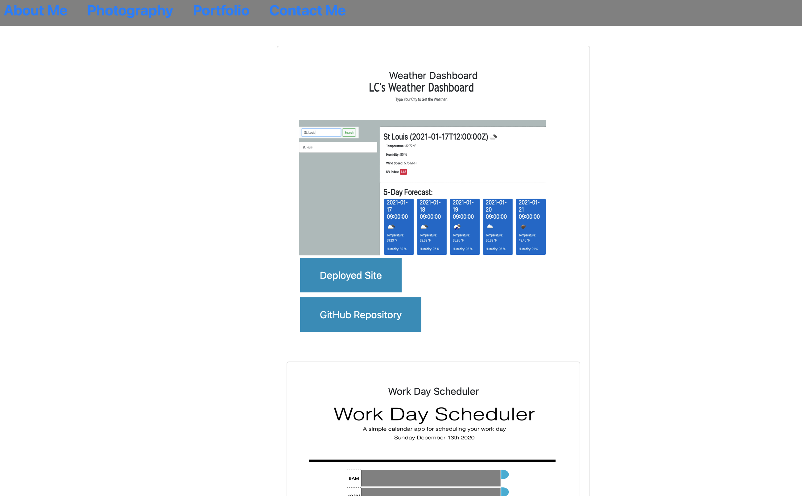

# LCarson_Professional_Portfolio

## Table of Contents
* Purpose of Project
* Actions Performed
* Technology Used
* Summary

## Purpose of Project
This website was created to provide users with a look into a couple of projects created in the Bootcamp Program.

* About - My hame and Bio.  Also lists my current occupation & an image of myself.
* Profile - With photography being one of my passions, I've provided a few of my favorite images.
* Contact - A form with data entry has been provided, along with an email addres.  Social media (LinkedIn & Instagram) links have also been provided.

## Technologies Used
* HTML
* CSS
* ootstrap

## Links
* Deployed Site:https://latuanja.github.io/LCarson_Professional_Portfolio/
* GitHub Repo: https://github.com/latuanja/LCarson_Professional_Portfolio

